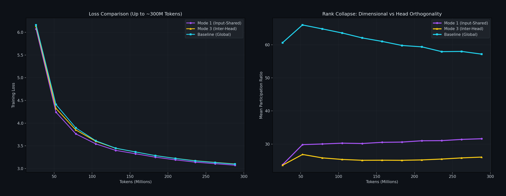
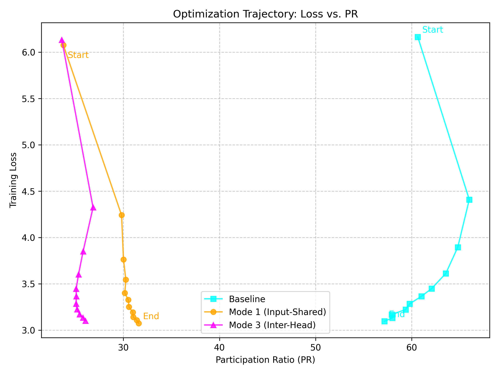
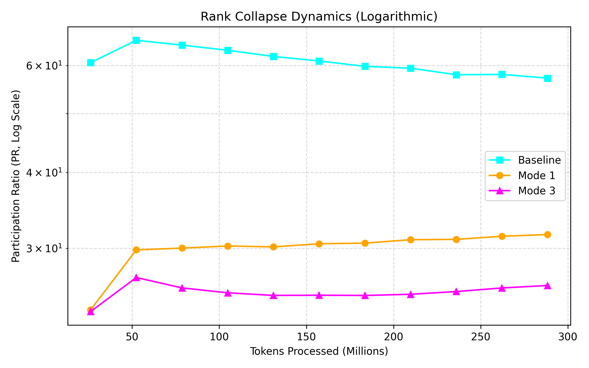
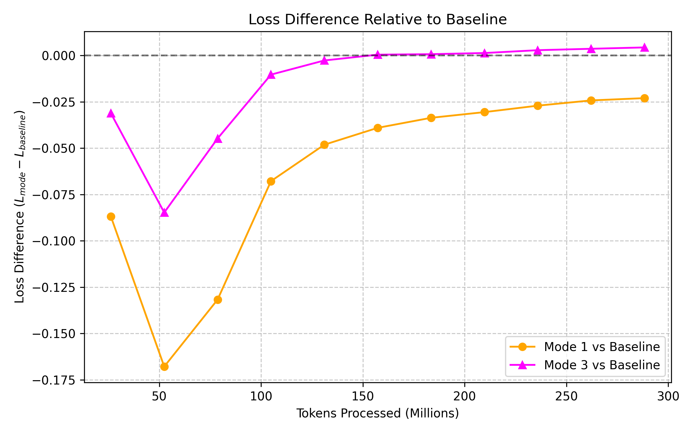

# Wasted LLM training compute = better loss?
### Research Progress Report
**Vuk Rosić** ([vukrosic/qk_norm_collapse](https://github.com/vukrosic/qk_norm_collapse))

These results may be used to speed up LLM pretraining with optimal orthogonalization constraints.

Mainly - the more you force parts of LLM to be orthogonal, the slower it learns early, but faster later.

Less orthogonalization makes more dimensions collapse to near 0, which makes loss go down faster early but is a bottleneck later in the training.

I ran 3 LLM training experiments testing different orthogonal constraints via the Muon optimizer. Muon works by forcing gradient matrix rows to be orthogonal (independent). By reshaping the gradient tensor before feeding it to Muon, we redefine what a "row" is, controlling *what* must be independent from *what*.

I applied these constraints to the Query and Key projections ($W_Q$ and $W_K$) of a ~650M parameter LLM.

Here are the 3 setups I compared:
1. **Standard Muon (Baseline)**: Global orthogonality. Every single dimension of every single head must be independent from everything else. Maximum forced diversity.
2. **Mode 1 (Input-Shared / HeadOrtho)**: Shared subspace. It forces the $i$-th feature dimension to be independent from the $j$-th feature dimension, but it allows identically-indexed features in *different heads* to be exactly the same. Heads can naturally align and collaborate.
3. **Mode 3 (Inter-Head)**: Independent heads. Head 1 as a whole must be orthogonal to Head 2 as a whole. However, the features *within* a single head are free to be perfectly correlated.

Find more detailed explanation below.

### The Results

I tracked the Training Loss and the Participation Ratio (PR), which is a way to measure the "effective rank" of the Query and Key projection matrices. For a matrix with singular values $\sigma_i$, PR is calculated as:

$$ \text{PR} = \frac{(\sum \sigma_i^2)^2}{\sum \sigma_i^4} $$

If PR stays high, the matrix is fully utilizing its diverse capacity (a lot of dimensions are away from 0). If PR drops, it means the representations are collapsing and correlating (some dimensions are close to 0).

We trained for 300 million tokens. *(Note: This is too short for a full LLM, but provides strong initial signals while we scale up compute).*

#### Quantitative Results at 300M Tokens
| Metric | **Mode 1 (Input-Shared)** | **Mode 3 (Inter-Head)** | **Baseline (Standard Muon)** |
| :--- | :---: | :---: | :---: |
| **Final Train Loss** | **3.073** | 3.100 | 3.096 |
| **Final PR** | 31.6 | 26.1 | **57.2** |

### What the Graphs and Table Tell Us

If we analyze the data above, a few very clear (and somewhat deeply weird) behaviors emerge:

*This trajectory plot tracks the path of each mode from Start to End. Notice how the Baseline (cyan) descends in loss while slowly bleeding its Participation Ratio (PR). In contrast, Mode 1 (orange) undergoes a sudden rank collapse early on, but its PR begins to slowly recover and drift rightward as it achieves a lower overall loss. Longer training is required (we are dealing with more compute right now)*

**1. Muon is Very Good at Keeping Rank High (Forced Diversity)**

* The **Baseline (cyan squares)** aggressively fights the model's natural tendency to simplify. By enforcing strict, massive-scale orthogonality across everything, standard Muon proves it is incredibly good at keeping the Participation Ratio high (~57.2). However, it is not perfectly preserved - over time, even the Baseline shows a slow, ongoing decay in rank.
* By comparison, when we relax the constraints within the heads (Mode 1 and Mode 3 have less orthogonality requirements), the model happily throws away its diversity early on and experiences a massive rank collapse. But after the initial crash, their PRs begin to slowly climb and actively improve towards the end of our training window. More training is required to see where those PRs would end up.

**2. Collapsed Heads Give Better Loss early, but seems like baseline is catching up!**

* Despite undergoing a massive early rank collapse, **Mode 1 descends the fastest initially** and currently holds the lowest training loss (3.073).
* However, while Mode 1 took an early lead, the Baseline's enforced diversity appears to be paying off. The loss difference between Mode 1 and Baseline peaked around -0.16, but has been shrinking since.

---

# Head Orthogonality in Muon Optimization: Experimental Setup

## Technical Details: Experimental Setup & Methodology

*(This section details the mathematical structures underlying the three modes summarized above).* 

To understand these ablations mathematically, we look at how rearranging the gradient tensor $G$ before Muon's inherent row-orthogonalization impacts what parameters are forced to be independent.

## 1. Methodology: Three Modes of Orthogonality

We investigate how the shape of the gradient tensor $G$ during the Newton-Schulz iteration affects the learning dynamics of the Key/Query projections ($W_{QK} \in \mathbb{R}^{H \cdot d_k \times d_{model}}$).

### Summary of Dimensional Constraints

The core difference lies in which components are forced into the same "row" (and thus forced to be orthogonal to others) vs. being in the same "vector" (and thus allowed to align).

| Mode | Reshape Target | Hierarchy of Orthogonality | Effective Constraint |
| :--- | :--- | :--- | :--- |
| **Baseline** | $(H \cdot d_k) \times d_{model}$ | Everything $\perp$ Everything | **Hardest constraint.** Maximum head diversity. |
| **Mode 1** | $d_k \times (H \cdot d_{model})$ | Row-Index $\perp$ Row-Index | **Shared subspace.** Heads are horizontally stacked; can collapse into each other. |
| **Mode 3** | $H \times (d_k \cdot d_{model})$ | Head $\perp$ Head | **Independent heads.** Each head is a unit; rows *within* a head can align. |

*   **Baseline** says: "Every single row (parameter vector) of every single head's weight projection matrix must be unique and orthogonal to all others."
*   **Mode 1** says: "The $i$-th row of Head 1 and the $i$-th row of Head 2 are part of the same long vector. They must be orthogonal to any $j$-th row ($i \neq j$), but Head 1 and Head 2 can use the same weights for the $i$-th dimension."
*   **Mode 3** says: "Head 1 as a whole (all its rows combined) must be orthogonal to Head 2 as a whole. Unlike the baseline, it doesn't care if rows *within* Head 1 are similar, only that the 'Head 1 subspace' is orthogonal to 'Head 2 subspace'."

### 1.1 Baseline: Global Matrix Orthogonality
**Standard Muon** treats the entire parameter matrix as a single 2D tensor.
$$G_{\text{base}} \in \mathbb{R}^{(H \cdot d_k) \times d_{model}}$$
where:
*   $H$ is the number of attention heads (e.g., 16).
*   $d_k$ is the dimension of each head (e.g., 128).
*   $d_{model}$ is the input hidden dimension (e.g., 2048).
*   **Each element $W_{QK}^{h,i}$ represents the $i$-th row vector of the QK projection matrix for head $h$.** It has size $d_{model}$.

The optimizer orthogonalizes the rows of this huge matrix.
*   **Constraint**: Every row (dimension of every head) is orthogonalized against every other row in the combined matrix.
*   **Effect**: This enforces a global diversity constraint across all $H \cdot d_k$ output dimensions simultaneously.

**Example ($H=2, d_k=2$):**
Everything must be orthogonal to everything else. Each row is a weight vector of size $d_{model}$.

| Matrix Row | Represents (Weight Vector) | Must be Orthogonal to: | Meaning |
| :--- | :--- | :--- | :--- |
| Row 1 | $W_{QK}^{1,1}$ | Row 2, Row 3, Row 4 | $W_{QK}^{1,1}$ must be different from $W_{QK}^{1,2}$, $W_{QK}^{2,1}$, etc. |
| **Row 2** | $W_{QK}^{1,2}$ | Row 1, Row 3, Row 4 | Features within Head 1 must be orthogonal. |
| **Row 3** | $W_{QK}^{2,1}$ | Row 1, Row 2, Row 4 | Head 2 must be orthogonal to Head 1. |
| **Row 4** | $W_{QK}^{2,2}$ | Row 1, Row 2, Row 3 | Features within Head 2 must be orthogonal. |

**Visual Matrix ($4 \times d_{model}$):**
$$
G_{\text{base}} = 
\begin{bmatrix}
w_{1,1,1} & w_{1,1,2} & \dots & w_{1,1,D} \\
w_{1,2,1} & w_{1,2,2} & \dots & w_{1,2,D} \\
w_{2,1,1} & w_{2,1,2} & \dots & w_{2,1,D} \\
w_{2,2,1} & w_{2,2,2} & \dots & w_{2,2,D}
\end{bmatrix}
\begin{matrix}
\leftarrow W_{QK}^{1,1} \text{ (Head 1, Row 1)} \\
\leftarrow W_{QK}^{1,2} \text{ (Head 1, Row 2)} \\
\leftarrow W_{QK}^{2,1} \text{ (Head 2, Row 1)} \\
\leftarrow W_{QK}^{2,2} \text{ (Head 2, Row 2)}
\end{matrix}
$$
All 4 rows are orthogonalized against each other.

### 1.2 Mode 1: Input-Shared Orthogonality ("HeadOrtho")
We reshape the gradient to separate the "head dimension" from the "feature dimension" and orthogonalize the $d_k$ feature dimensions across a shared input space.
$$G_{\text{mode1}} \in \mathbb{R}^{d_k \times (H \cdot d_{model})}$$
*   **Constraint**: The $i$-th feature dimension is orthogonalized against the $j$-th feature dimension, aggregating the vector across all heads.
*   **Structure**: This treats the $H$ heads as contributing to a single shared $d_k$-dimensional subspace. It does not enforce orthogonality *between* different heads for the same feature dimension.

**Example ($H=2, d_k=2$):**
We reshape to only 2 big rows ($d_k=2$). Each row is a *concatenation* of the vectors for that feature row across all heads.

| Matrix Row | Represents (Concatenated Vector) | Must be Orthogonal to: | Meaning |
| :--- | :--- | :--- | :--- |
| **Row 1** | $W_{QK}^{1,1} \oplus W_{QK}^{2,1}$ | Row 2 | Row 1 subspace must be orthogonal to Row 2 subspace. |
| **Row 2** | $W_{QK}^{1,2} \oplus W_{QK}^{2,2}$ | Row 1 | **$W_{QK}^{1,1}$ and $W_{QK}^{2,1}$ can be identical.** |

**Visual Matrix ($2 \times 2 \cdot d_{model}$):**
$$
G_{\text{mode1}} = 
\begin{bmatrix}
\underbrace{w_{1,1,1} \dots w_{1,1,D}}_{W_{QK}^{1,1} \text{ (Head 1)}} & \mathbf{|} & \underbrace{w_{2,1,1} \dots w_{2,1,D}}_{W_{QK}^{2,1} \text{ (Head 2)}} \\
\underbrace{w_{1,2,1} \dots w_{1,2,D}}_{W_{QK}^{1,2} \text{ (Head 1)}} & \mathbf{|} & \underbrace{w_{2,2,1} \dots w_{2,2,D}}_{W_{QK}^{2,2} \text{ (Head 2)}}
\end{bmatrix}
$$
Only Top Row $\perp$ Bottom Row. Head 1 and Head 2 are just different columns in the same row vector!

### 1.3 Mode 3: Inter-Head Orthogonality
We reshape to force heads to be orthogonal to each other.
$$G_{\text{mode3}} \in \mathbb{R}^{H \times (d_k \cdot d_{model})}$$
*   **Constraint**: The gradient update vector for `Head i` is orthogonalized against `Head j`.
*   **Structure**: This specifically targets the independence of attention heads, treating each head as a unit vector in the parameter space.

**Example ($H=2, d_k=2$):**
We reshape to only 2 big rows (one per Head, $H=2$). Each row is a *concatenation* of all feature rows in that head.

| Matrix Row | Represents (Concatenated Vector) | Must be Orthogonal to: | Meaning |
| :--- | :--- | :--- | :--- |
| **Row 1** | $W_{QK}^{1,1} \oplus W_{QK}^{1,2}$ | Row 2 | **Head 1 must be orthogonal to Head 2.** |
| **Row 2** | $W_{QK}^{2,1} \oplus W_{QK}^{2,2}$ | Row 1 | Features within a head can be anything (as long as orthogonal to H1). |

**Visual Matrix ($2 \times 2 \cdot d_{model}$):**
$$
G_{\text{mode3}} = 
\begin{bmatrix}
\underbrace{w_{1,1,1} \dots w_{1,1,D}}_{W_{QK}^{1,1}} & \mathbf{|} & \underbrace{w_{1,2,1} \dots w_{1,2,D}}_{W_{QK}^{1,2}} \\
\underbrace{w_{2,1,1} \dots w_{2,1,D}}_{W_{QK}^{2,1}} & \mathbf{|} & \underbrace{w_{2,2,1} \dots w_{2,2,D}}_{W_{QK}^{2,2}}
\end{bmatrix}
\begin{matrix}
\leftarrow \text{Head 1 Parameters} \\
\leftarrow \text{Head 2 Parameters}
\end{matrix}
$$
Top Row (Head 1) $\perp$ Bottom Row (Head 2).

---

---

## 2. Experimental Setup

To compare these modes, we conducted training runs using a ~650M parameter Language Model.

### 2.1 Model Architecture
*   **Parameters**: ~650 Million
*   **Layers**: 12
*   **Hidden Dimension ($d_{model}$)**: 2048
*   **Attention Heads**: 16 (with 8 KV heads for Grouped-Query Attention)
*   **Head Dimension ($d_k$)**: 128
*   **Sequence Length**: 2048

### 2.2 Training Configuration
*   **Dataset**: SmolLM-corpus.
*   **Tokens Trained**: 300 Million.
*   **Batch Size**: 32 with gradient accumulation of 4 (Effective Batch Size ~262k tokens).
*   **Optimizer**: Muon (for 2D parameters) + AdamW (for embeddings/normalization).
*   **Learning Rate**: Muon LR 0.05, AdamW LR 0.005.

### 2.3 Metrics Tracked
We monitor two primary metrics throughout training:
1.  **Training Loss**: Measuring the optimization efficiency.
2.  **Participation Ratio (PR)**: Estimating the effective rank of the Key/Query projection matrices to quantify "Rank Collapse" versus strict orthogonality.

---

## 3. Conclusion

As extensively plotted and discussed in the first section of this document, globally enforcing orthogonality (Baseline) artificially sustains projection matrix rank, briefly slowing start-of-training optimization. Relaxing this constraint allows natural correlations and structural groupings (Modes 1 & 3), causing a massive rank drop but yielding an extremely fast initial loss descent. However, because the Baseline begins catching up as it utilizes its retained diversity, the true long-term optimal inductive bias remains an open question.
