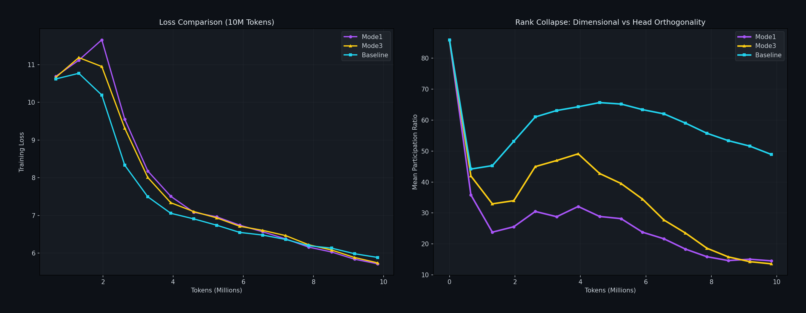

# HeadOrtho: The "Rank Collapse is Optimal" Hypothesis (10M Token Scale)

## Overview
We hypothesized that the rapid "rank collapse" observed in HeadOrtho (Mode-1) was due to the optimizer exploiting a relaxed constraint: fitting the heads into a shared, lower-dimensional subspace to minimize loss efficiently. 

To test this, we ran **Mode-3 HeadOrtho**, designed to strictly **prevent** this collapse by forcing heads to be orthogonal to *each other*. We now have full 10M token results for all three methods.

## Experimental Results (at 10M Tokens)

| Method | Constraint Type | Final Rank (PR) | Final Loss | Status |
| :--- | :--- | :---: | :---: | :--- |
| **Mode 1** | Input-Side Orthogonality (Shared) | **LOW (~14.5)** | **BEST (5.71)** | **Collapse is Good** |
| **Baseline** | Global Matrix Orthogonality | Medium (~48.9) | Good (5.88) | Standard |
| **Mode 3** | Inter-Head Orthogonality | **LOW (~13.6)** | **BEST (5.74)** | **Converged to Mode 1?** |

## Analysis

### 1. The Unexpected Convergence
At early stages (<3M tokens), Mode-3 maintained high rank (>50) and had terrible loss (>10). However, as training progressed to 10M tokens, **Mode-3 collapsed too**.
- **Rank Drop**: 86 -> 50 (plateau) -> 13.6 (Final)
- **Loss Improvement**: 10.7 -> 5.74 (Catching up to Mode 1)

### 2. The Interpretation
It appears that the pressure to minimize loss is so strong that the model found a way to collapse the rank *despite* the Mode-3 constraint, or perhaps the constraint itself pushes towards a low-rank solution in a different way over time. 
- **Mode-1** collapsed early (0-3M tokens) and got a head start on loss.
- **Mode-3** fought the collapse initially (high loss), but eventually succumbed to the same low-rank structure (~13.6 PR), bringing its loss down to match Mode-1 (5.74 vs 5.71).

### Conclusion
**Low Rank is the Attractor.** Whether we encourage it (Mode-1) or try to fight it (Mode-3), the model eventually finds its way to a low-rank participation ratio (~13-14) to minimize loss. Mode-1 is simply the "fast lane" to this optimal state.

