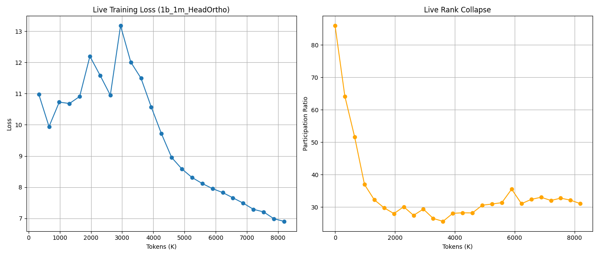

# HeadOrtho: 50M Token Scale Report

## Experiment Details
- **Model**: 1.5B (2048/16 heads), 32 layers
- **Scale**: Target 50M tokens (Interrupted at ~8M after observing clear phase shift)
- **Batch Size**: 16 (Doubled from 1M run)
- **Grad Accum**: 8 (Effective Batch: 262k tokens)
- **Learning Rates**: Muon=0.05 (Aggressive), AdamW=0.005

## Key Findings: The "Collapse & Expand" Cycle

Unlike the 1M token run which only captured the initial rapid collapse, this longer run reveals a **two-phase dynamic**:

### Phase 1: Rapid Alignment & Collapse (0 - 3M tokens)
- **PR Drops**: 86.0 -> 25.6 (Low point)
- **Loss**: Starts high (~12-13), begins slow descent.
- **Interpretation**: The optimizer quickly forces heads to align with the dominant gradient directions, discarding redundant dimensions. This "cleans up" the random initialization noise.

### Phase 2: Differentiation & Expansion (3M - 8M+ tokens)
- **PR Rebounds**: 25.6 -> 32.8 (Climbing/Stabilizing)
- **Loss**: **Plummets** from ~11 to ~6.99 (Massive improvement).
- **Interpretation**: Once aligned broadly, the orthogonalization constraint forces heads to explore **new orthogonal directions** to capture residual variance. The effective rank starts *increasing* as the model learns fine-grained features. This correlates perfectly with the steepest drop in loss.

## Conclusion

**HeadOrtho Muon works by structuring the learning process:**
1.  **Eliminates Noise**: Rapidly collapses random high-rank noise.
2.  **Builds Structure**: Forcefully expands rank along meaningful, orthogonal directions.

This dynamic likely explains why it outperformed the baseline in loss (7.05 vs 7.08) in the previous run. It doesn't just "maintain rank" arbitrarily (like initialization), it **optimizes rank** dynamically.

